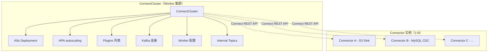
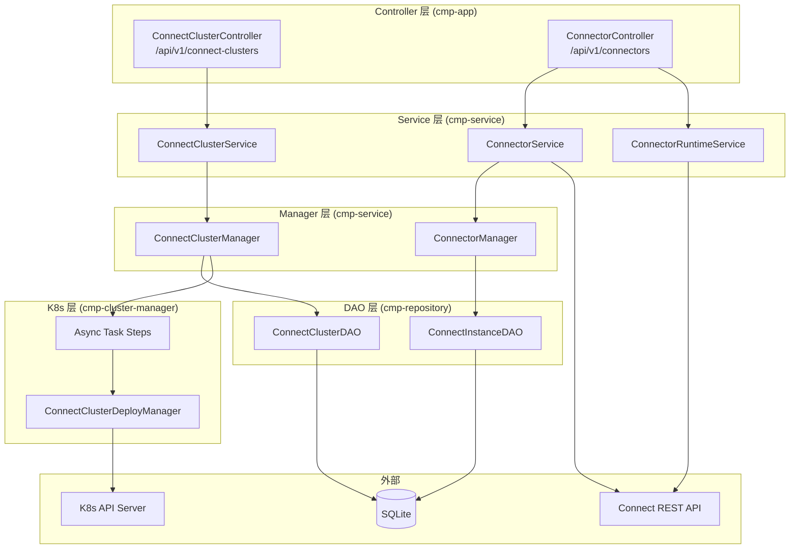
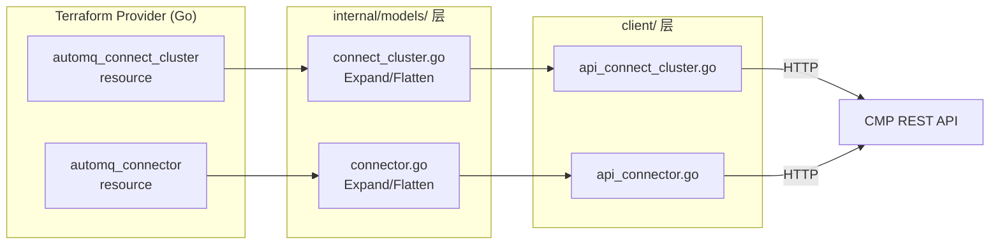

# Design Document: CMP Connect 多租户重构

## Overview

本设计将 CMP Connect 模块从单资源模型（1 KubernetesConnector = 1 Worker 集群 + 1 Connector）重构为两层资源模型（1 ConnectCluster : N Connector），支持多租户共享 Worker 集群。

核心变化：
- 资源拆分：`ConnectCluster` 管理基础设施（K8s 部署、容量、Kafka 连接、插件集、Worker 配置），`Connector` 只管业务配置（connector class、task count、connector config）
- Connector 创建从分钟级降低到秒级（仅 Connect REST API 调用，不涉及 K8s 部署）
- 支持 provisioned（固定容量）和 autoscaling（自动伸缩）两种容量模式
- 插件管理参考 Strimzi，在 ConnectCluster 级别声明插件列表，支持多插件共存

涉及三个代码仓库/模块：
1. 后端 CMP（automqbox Spring Boot）：新建 ConnectCluster API，重构 Connector API，数据库迁移
2. 前端 CMP（cmp-frontend-next React + Cloudscape）：页面结构调整
3. Terraform Provider（terraform-provider-automq Go）：新建 `automq_connect_cluster` 资源，重构 `automq_connector` 资源

## Architecture

### 两层资源模型



### 请求流对比

**现状（单资源）：**
```
创建 Connector → ConnectorService → KubernetesConnectorManager
  → DB 写入 + 异步 Task（4 Steps: Apply → CheckReady → InitEndpoints → BootstrapConnector）
  → 分钟级
```

**目标（两层资源）：**
```
创建 ConnectCluster → ConnectClusterService → ConnectClusterManager
  → DB 写入 + 异步 Task（3 Steps: Apply → CheckReady → InitEndpoints）
  → 分钟级

创建 Connector → ConnectorService → ConnectorManager
  → DB 写入 + Connect REST API POST /connectors
  → 秒级
```

### 后端分层架构



### Terraform Provider 架构



## Components and Interfaces

### 后端组件

#### 1. ConnectClusterController

新建 REST 控制器，路径 `/api/v1/connect-clusters`。

| 方法 | 路径 | 权限 | 说明 |
|------|------|------|------|
| POST | `/` | CONNECT_CLUSTER_CREATE | 创建集群 |
| GET | `/{id}` | CONNECT_CLUSTER_VIEW | 查询集群 |
| PUT | `/{id}` | CONNECT_CLUSTER_UPDATE | 更新集群 |
| DELETE | `/{id}` | CONNECT_CLUSTER_DELETE | 删除集群（有 Connector 则拒绝） |
| GET | `/` | CONNECT_CLUSTER_LIST | 列表查询 |
| GET | `/{id}/workers` | CONNECT_CLUSTER_VIEW | Worker 状态 |
| GET | `/{id}/metrics` | CONNECT_CLUSTER_VIEW | 集群指标（CPU/内存/GC） |
| GET | `/{id}/logs` | CONNECT_CLUSTER_VIEW | 集群日志（全量） |
| GET | `/versions` | CONNECT_CLUSTER_LIST | 版本列表 |

#### 2. ConnectorController（重构）

保留路径 `/api/v1/connectors`，语义变为纯 Connector 管理。

| 方法 | 路径 | 权限 | 说明 |
|------|------|------|------|
| POST | `/` | CONNECTOR_CREATE | 创建 Connector |
| GET | `/{id}` | CONNECTOR_VIEW | 查询 Connector |
| PUT | `/{id}` | CONNECTOR_UPDATE | 更新 Connector |
| DELETE | `/{id}` | CONNECTOR_DELETE | 删除 Connector |
| GET | `/` | CONNECTOR_LIST | 列表（支持 `?connectClusterId=` 过滤） |
| POST | `/{id}:pause` | CONNECTOR_CONTROL | 暂停 |
| POST | `/{id}:resume` | CONNECTOR_CONTROL | 恢复 |
| POST | `/{id}:restart` | CONNECTOR_CONTROL | 重启 |
| GET | `/{id}/tasks` | CONNECTOR_VIEW | Task 状态 |

#### 3. ConnectClusterService

新建 Service，核心业务逻辑：

```java
public interface ConnectClusterService {
    ConnectClusterVO create(ConnectClusterCreateParam param);
    ConnectClusterVO update(String id, ConnectClusterUpdateParam param);
    void delete(String id);
    ConnectClusterVO getById(String id);
    PageNumResult<ConnectClusterVO> query(ConnectClusterQuery query, PermissionValidation pv);
}
```

`create()` 关键逻辑：
1. 校验 plugins 版本冲突（Q2：同一插件名不允许不同版本）
2. 校验 K8s 可达性
3. 强制注入 Worker 配置（Q9: `connector.client.config.override.policy=None`，Q18: `connect.protocol=compatible`）
4. 生成内部 Topic 名称，固定 partition 数（Q3: offset=16, status=16, config=1）
5. 持久化 + 提交异步创建 Task

`delete()` 关键逻辑：
1. 前置校验：查询是否有 Connector 引用（Q14），有则拒绝
2. 清理内部 Topic（Q13）
3. 提交异步删除 Task

#### 4. ConnectorService（重构）

大幅简化，不再管理 K8s 资源：

```java
public interface ConnectorService {
    ConnectorVO create(ConnectorCreateParam param);
    ConnectorVO update(String id, ConnectorUpdateParam param);
    void delete(String id);
    ConnectorVO getById(String id);
    PageNumResult<ConnectorVO> query(ConnectorQuery query, PermissionValidation pv);
    ConnectorVO pause(String id);
    ConnectorVO resume(String id);
    ConnectorVO restart(String id);
}
```

`create()` 关键逻辑：
1. 校验 name 全局唯一（Q11）
2. 校验 connectClusterId 存在
3. 如果 Cluster 未就绪，入队等待（Q10）
4. 通过 ConnectRestClient `POST /connectors` 创建
5. 如果有 initialOffsets，调用 `PATCH /connectors/{name}/offsets`（Q12）
6. 持久化到 DB

#### 5. ConnectClusterManager

新建 Manager，负责 DB 持久化 + 异步 Task 提交：

```java
public interface ConnectClusterManager {
    ConnectCluster create(ConnectCluster cluster);
    ConnectCluster update(ConnectCluster cluster);
    void delete(String clusterId);
    ConnectCluster getById(String clusterId);
}
```

#### 6. ConnectorManager（精简）

不再管理 K8s 资源，只做 DB 持久化：

```java
public interface ConnectorManager {
    Connector create(Connector connector);
    Connector update(Connector connector);
    void delete(String connectorId);
    Connector getById(String connectorId);
    List<Connector> listByClusterId(String clusterId);  // Q14 删除前校验用
}
```

#### 7. ConnectClusterDeployManager（调整）

manifest 生成支持多插件（已有 `buildConnectManifest(connector, instance, pluginList)` 方法），新增：
- HPA YAML 生成（autoscaling 模式）
- 强制配置注入（connect.protocol、override.policy、internal topic partitions）

#### 8. 异步 Task 调整

ConnectCluster 创建 Task 保留 3 个 Step：
1. `ConnectClusterApplyStep` — K8s manifest apply（支持多插件 + HPA）
2. `ConnectClusterCheckReadyStep` — 轮询 Pod Ready
3. `ConnectClusterInitEndpointsStep` — 获取 Pod IP:Port

移除 `ConnectClusterBootstrapConnectorStep`（Connector 创建独立于 Cluster）。

### Terraform Provider 组件

#### 1. automq_connect_cluster resource

新建文件：
- `client/api_connect_cluster.go` — CRUD API 调用
- `client/model_connect_cluster.go` — 请求/响应模型
- `internal/models/connect_cluster.go` — Expand/Flatten + ResourceModel
- `internal/provider/resource_connect_cluster.go` — Schema + CRUD handler + 异步等待

Schema 核心属性（参考 `docs/design/automq-connector-api-v2-schema.md`）：
- Required: `environment_id`(ForceNew), `name`, `plugins`, `kafka_cluster`, `capacity`, `compute`
- Optional: `description`, `worker_config`, `metric_exporter`, `tags`, `version`
- Computed: `id`, `state`, `kafka_connect_version`, `created_at`, `updated_at`

Create 流程：调用 CMP API → 轮询等待 STEADY 状态（timeout 30m）
Delete 流程：调用 CMP API → 轮询等待删除完成（timeout 20m）

#### 2. automq_connector resource（重构）

修改文件：
- `client/model_connector.go` — 精简请求参数，新增 `connect_cluster_id`、`connector_config_sensitive`、`initial_offsets`
- `internal/models/connector.go` — 重写 Expand/Flatten，移除基础设施字段
- `internal/provider/resource_connector.go` — 重写 Schema，移除基础设施属性

Schema 核心属性：
- Required: `environment_id`(ForceNew), `connect_cluster_id`(ForceNew), `name`, `connector_class`(ForceNew), `task_count`
- Optional: `description`, `connector_config`, `connector_config_sensitive`(Sensitive), `initial_offsets`(Create-only)
- Computed: `id`, `state`, `connector_type`, `plugin_id`, `created_at`, `updated_at`

Create 流程：调用 CMP API → 同步返回（秒级，无需轮询）
Delete 流程：调用 CMP API → 同步返回

### 前端组件

#### API 层 (`service/connect.ts`)

新增 ConnectCluster API：
```typescript
getConnectClusters:    GET    /connect-clusters
createConnectCluster:  POST   /connect-clusters
getConnectCluster:     GET    /connect-clusters/{id}
updateConnectCluster:  PUT    /connect-clusters/{id}
deleteConnectCluster:  DELETE /connect-clusters/{id}
listClusterWorkers:    GET    /connect-clusters/{id}/workers
getClusterMetrics:     GET    /connect-clusters/{id}/metrics
getClusterLogs:        GET    /connect-clusters/{id}/logs
```

新增/重构 Connector API：
```typescript
getConnectors:         GET    /connectors?connectClusterId=xxx
createConnector:       POST   /connectors
getConnector:          GET    /connectors/{id}
updateConnector:       PUT    /connectors/{id}
deleteConnector:       DELETE /connectors/{id}
pauseConnector:        POST   /connectors/{id}:pause
resumeConnector:       POST   /connectors/{id}:resume
restartConnector:      POST   /connectors/{id}:restart
listConnectorTasks:    GET    /connectors/{id}/tasks
```

#### 页面结构

```
/connect-clusters                              集群列表（改造）
/connect-clusters/create                       创建集群（改造：移除 Connector 配置步骤，新增 plugins 配置）
/connect-clusters/detail/:clusterId            集群详情（改造：新增 Connectors Tab）
  /resize                                      扩缩容
  /update-config                               更新 Worker 配置
  /update-plugins                              更新插件列表（新增）
  /update-metrics-exporter                     更新指标导出
  /upgrade-version                             版本升级
/connect-clusters/:clusterId/connectors/create 创建 Connector（新增）
/connectors/:connectorId                       Connector 详情（新增）
  /update-config                               更新 Connector 配置（新增）
```


## Data Models

### 后端 Entity

#### ConnectCluster Entity

从 `KubernetesConnector` 抽出集群相关字段，新建 `ConnectCluster.java`：

```java
@Data
public class ConnectCluster {
    // 基本信息
    private String id;                    // connect-cluster-{uuid8}
    private String name;
    private String description;
    private String deploymentName;        // connect-deployment-{uuid8}

    // 插件集（Q1: Strimzi 模式）
    private List<ClusterPlugin> plugins;  // [{name, version}]

    // Kafka 连接
    private String kafkaInstanceId;
    private SecurityProtocolConfig securityProtocolConfig;
    private String kafkaBootstrapServers;

    // K8s 部署
    private String kubernetesClusterId;
    private String kubernetesNamespace;
    private String kubernetesServiceAccount;
    private ServiceAccountAuthMode authMode;
    private String iamRole;
    private String region;
    private KubernetesSchedulingSpec kubernetesSchedulingSpec;
    private String schedulingSpecYaml;

    // 容量（Q6: provisioned + autoscaling）
    private CapacityType capacityType;    // PROVISIONED | AUTOSCALED
    private int workerCount;
    private String workerCpuRequest;
    private String workerMemRequest;
    private String workerCpuLimit;
    private String workerMemLimit;
    // autoscaling 专属
    private Integer minWorkerCount;
    private Integer maxWorkerCount;
    private Integer scaleInCpuPercent;
    private Integer scaleOutCpuPercent;

    // Worker 配置
    private Map<String, Object> workerProperties;
    private Map<String, Object> properties;  // overrides

    // 指标
    private ConnectorMetricsConfig metricsConfig;

    // 运行时
    private ConnectClusterState state;
    private List<String> podEndPoints;

    // 元数据
    private Map<String, String> tags;
    private String version;
    private Instant createTime;
    private Instant updateTime;
}
```

#### ClusterPlugin 值对象

```java
@Data
public class ClusterPlugin {
    private String name;      // 插件名（如 "s3-sink"）
    private String version;   // 版本（如 "11.1.0"）
}
```

#### Connector Entity（精简）

从 `KubernetesConnector` 精简为纯 Connector 信息：

```java
@Data
public class Connector {
    private String id;                    // conn-{uuid8}
    private String connectClusterId;      // 引用 ConnectCluster
    private String name;                  // 全局唯一（Q11）
    private String description;

    private String connClass;             // connector class（Java 全限定类名）
    private PluginType connType;          // SOURCE/SINK（Computed，后端推导）
    private String pluginId;              // Computed，后端根据 connClass + cluster plugins 推导
    private int taskCount;

    private Map<String, Object> connectorProperties;
    private Map<String, Object> connectorPropertiesSensitive;  // 敏感配置（Q4）
    private List<InitialOffset> initialOffsets;                 // Q12

    private ConnectorState state;         // 独立于 Cluster 状态（Q15）
    private Instant createTime;
    private Instant updateTime;
}
```

#### InitialOffset 值对象

```java
@Data
public class InitialOffset {
    private Map<String, String> partition;
    private Map<String, String> offset;
}
```

### 状态模型

#### ConnectClusterState（保持不变）

```
CREATE_SUBMITTED → APPLYING_MANIFEST → WAITING_FOR_PODS → STEADY
UPDATE_SUBMITTED → ROLLING_UPDATE → STEADY
DELETE_SUBMITTED → DELETING → (记录删除)
FAILED（任何阶段都可能进入）
```

#### ConnectorState（语义独立于 Cluster）

```
PENDING → CREATING → RUNNING
PAUSED（用户主动暂停）
FAILED（任何阶段都可能进入）
DELETING → (记录删除)
```

新增 `PENDING` 状态：Cluster 未就绪时创建的 Connector 进入此状态（Q10）。

#### 外部状态映射

| 内部状态 | API 返回状态 | 说明 |
|----------|-------------|------|
| ConnectCluster: CREATE_SUBMITTED/APPLYING_MANIFEST/WAITING_FOR_PODS | CREATING | 集群创建中 |
| ConnectCluster: STEADY | RUNNING | 集群运行中 |
| ConnectCluster: ROLLING_UPDATE | CHANGING | 集群变更中（Q20） |
| ConnectCluster: FAILED | FAILED | 集群失败 |
| ConnectCluster: DELETING | DELETING | 集群删除中 |
| Connector: PENDING | CREATING | 等待 Cluster 就绪 |
| Connector: CREATING | CREATING | 正在通过 REST API 创建 |
| Connector: RUNNING | RUNNING | 运行中（从 Connect REST API 获取） |
| Connector: PAUSED | PAUSED | 已暂停 |
| Connector: FAILED | FAILED | 失败 |

### 数据库 Schema

#### 新建表 `cmp_connect_cluster`

```sql
CREATE TABLE cmp_connect_cluster (
    id                    INTEGER PRIMARY KEY AUTOINCREMENT,
    gmt_create            TIMESTAMP DEFAULT CURRENT_TIMESTAMP,
    gmt_modified          TIMESTAMP DEFAULT CURRENT_TIMESTAMP,
    cluster_id            TEXT NOT NULL UNIQUE,        -- 业务 ID: connect-cluster-{uuid8}
    name                  TEXT NOT NULL,
    description           TEXT,
    deployment_name       TEXT,
    plugins               TEXT,                         -- JSON: [{name, version}]
    kafka_instance_id     TEXT NOT NULL,
    security_config_code  TEXT,
    kafka_bootstrap_servers TEXT,
    kubernetes_cluster_id TEXT NOT NULL,
    namespace             TEXT NOT NULL,
    service_account       TEXT NOT NULL,
    iam_role              TEXT,
    region                TEXT,
    state                 TEXT NOT NULL,
    capacity_type         TEXT NOT NULL,                -- PROVISIONED | AUTOSCALED
    workers_count         INTEGER NOT NULL DEFAULT 1,
    worker_cpu_request    TEXT,
    worker_mem_request    TEXT,
    worker_cpu_limit      TEXT,
    worker_mem_limit      TEXT,
    min_worker_count      INTEGER,
    max_worker_count      INTEGER,
    scale_in_cpu_percent  INTEGER,
    scale_out_cpu_percent INTEGER,
    worker_properties     TEXT,                         -- JSON
    properties            TEXT,                         -- JSON (overrides)
    tags                  TEXT,                         -- JSON
    pod_end_points        TEXT,                         -- JSON
    version               TEXT,
    scheduling_spec_raw   TEXT,
    scheduling_spec_struct TEXT,
    metrics_config        TEXT                          -- JSON
);
```

#### 修改表 `cmp_connect_instance`

新增列：
- `connect_cluster_id TEXT` — 引用 ConnectCluster
- `connector_config_sensitive TEXT` — 敏感配置 JSON

移除列（迁移到 `cmp_connect_cluster`）：
- `kubernetes_cluster_id`, `namespace`, `service_account`, `iam_role`
- `capacity_type`, `workers_count`, `worker_cpu_*`, `worker_mem_*`
- `kafka_instance_id`, `security_config_code`, `kafka_bootstrap_servers`
- `worker_properties`, `properties`(overrides)
- `pod_end_points`, `region`, `version`
- `scheduling_spec_raw`, `scheduling_spec_struct`
- `deployment_name`

保留列：
- `id`, `instance_id`, `gmt_create`, `gmt_modified`
- `name`, `description`
- `connect_cluster_id`（新增）
- `plugin_id`, `conn_type`, `conn_class`, `task_count`
- `connector_properties`, `connector_config_sensitive`（新增）
- `state`, `labels`

### 数据库迁移策略

#### CMP 迁移机制

CMP 使用自定义的 `SimpleDDLExecutor`，在应用启动时自动扫描 `classpath*:sql/**/*.sql` 下的所有 SQL 文件，按文件名字母序排序后逐条执行。关键特性：
1. 每条 SQL 独立执行，失败只 `log.warn` 不中断（幂等友好）
2. 文件按文件名排序（用 `v7.8.0_`、`v8.1.0_` 前缀控制顺序）
3. `CREATE TABLE IF NOT EXISTS` 保证重复执行安全
4. `ALTER TABLE ADD COLUMN` 在 SQLite 中列已存在会报错，但被 catch 住只 warn
5. BYOC 客户升级时，CMP 重启即自动执行新的 migration SQL，无需手动干预

因此所有迁移 SQL 必须满足幂等性要求：重复执行不会报错、不会产生重复数据。

#### 迁移 SQL 文件

文件名：`cmp-app/src/main/resources/sql/v8.3.0_connect_multi_tenant.sql`

```sql
-- =============================================================================
-- CMP Connect 多租户迁移脚本
-- 版本: v8.2.0
-- 幂等性: 所有语句可重复执行，不会报错或产生重复数据
-- =============================================================================

-- Step 1: 创建 cmp_connect_cluster 表（IF NOT EXISTS 保证幂等）
CREATE TABLE IF NOT EXISTS cmp_connect_cluster (
    id                    INTEGER PRIMARY KEY AUTOINCREMENT,
    gmt_create            TIMESTAMP DEFAULT CURRENT_TIMESTAMP,
    gmt_modified          TIMESTAMP DEFAULT CURRENT_TIMESTAMP,
    cluster_id            TEXT NOT NULL UNIQUE,
    name                  TEXT NOT NULL,
    description           TEXT,
    deployment_name       TEXT,
    plugins               TEXT,
    kafka_instance_id     TEXT NOT NULL,
    security_config_code  TEXT,
    kafka_bootstrap_servers TEXT,
    kubernetes_cluster_id TEXT NOT NULL,
    namespace             TEXT NOT NULL,
    service_account       TEXT NOT NULL,
    iam_role              TEXT,
    region                TEXT,
    state                 TEXT NOT NULL,
    capacity_type         TEXT NOT NULL,
    workers_count         INTEGER NOT NULL DEFAULT 1,
    worker_cpu_request    TEXT,
    worker_mem_request    TEXT,
    worker_cpu_limit      TEXT,
    worker_mem_limit      TEXT,
    min_worker_count      INTEGER,
    max_worker_count      INTEGER,
    scale_in_cpu_percent  INTEGER,
    scale_out_cpu_percent INTEGER,
    worker_properties     TEXT,
    properties            TEXT,
    tags                  TEXT,
    pod_end_points        TEXT,
    version               TEXT,
    scheduling_spec_raw   TEXT,
    scheduling_spec_struct TEXT,
    metrics_config        TEXT
);

CREATE INDEX IF NOT EXISTS idx_cmp_connect_cluster_cluster_id ON cmp_connect_cluster(cluster_id);
CREATE INDEX IF NOT EXISTS idx_cmp_connect_cluster_name ON cmp_connect_cluster(name);
CREATE INDEX IF NOT EXISTS idx_cmp_connect_cluster_state ON cmp_connect_cluster(state);
CREATE INDEX IF NOT EXISTS idx_cmp_connect_cluster_kafka_instance_id ON cmp_connect_cluster(kafka_instance_id);

-- Step 2: 给 cmp_connect_instance 添加新列（ALTER ADD COLUMN 失败会被 catch warn，幂等）
ALTER TABLE cmp_connect_instance ADD COLUMN connect_cluster_id TEXT;
ALTER TABLE cmp_connect_instance ADD COLUMN connector_config_sensitive TEXT;

-- Step 3: 从现有数据迁移集群信息（INSERT OR IGNORE 保证幂等，不会重复插入）
INSERT OR IGNORE INTO cmp_connect_cluster (
    cluster_id, name, description, deployment_name,
    kafka_instance_id, security_config_code, kafka_bootstrap_servers,
    kubernetes_cluster_id, namespace, service_account, iam_role, region,
    state, capacity_type, workers_count,
    worker_cpu_request, worker_mem_request, worker_cpu_limit, worker_mem_limit,
    worker_properties, properties, tags, pod_end_points,
    version, scheduling_spec_raw, scheduling_spec_struct
)
SELECT
    'cluster-' || instance_id, name, description, deployment_name,
    kafka_instance_id, security_config_code, kafka_bootstrap_servers,
    kubernetes_cluster_id, namespace, service_account, iam_role, region,
    state, capacity_type, workers_count,
    worker_cpu_request, worker_mem_request, worker_cpu_limit, worker_mem_limit,
    worker_properties, properties, labels, pod_end_points,
    version, scheduling_spec_raw, scheduling_spec_struct
FROM cmp_connect_instance
WHERE instance_id NOT IN (SELECT REPLACE(cluster_id, 'cluster-', '') FROM cmp_connect_cluster);

-- Step 4: 回填 connect_cluster_id（WHERE 条件保证幂等，已有值的不会被覆盖）
UPDATE cmp_connect_instance
SET connect_cluster_id = 'cluster-' || instance_id
WHERE connect_cluster_id IS NULL;
```

迁移后现有数据变成 1:1（一个 cluster 一个 connector），新创建的可以是 1:N。

#### 升级兼容性

- 新部署：`CREATE TABLE IF NOT EXISTS` 创建空表，无数据迁移
- 从单租升级：自动迁移现有数据为 1:1 映射
- 重复执行：所有语句幂等，CMP 重启不会产生副作用
- SQLite 限制：不支持 `DROP COLUMN`，旧列保留但不再使用（代码中不读取）
- 回滚：如需回滚到旧版本，旧代码继续读 `cmp_connect_instance` 的原有列，新增的 `connect_cluster_id` 列和 `cmp_connect_cluster` 表不影响旧代码运行

### Terraform Provider 数据模型

#### ConnectCluster API 模型 (`client/model_connect_cluster.go`)

```go
// 请求参数
type ConnectClusterCreateParam struct {
    Name           string                         `json:"name"`
    Description    *string                        `json:"description,omitempty"`
    Plugins        []ClusterPluginParam           `json:"plugins"`
    KafkaCluster   ConnectClusterKafkaParam       `json:"kafkaCluster"`
    Capacity       ConnectClusterCapacityParam     `json:"capacity"`
    Compute        ConnectClusterComputeParam      `json:"compute"`
    WorkerConfig   *ConnectorWorkerConfigParam     `json:"workerConfig,omitempty"`
    MetricExporter *ConnectMetricsConfigParam      `json:"metricExporter,omitempty"`
    Tags           map[string]string               `json:"tags,omitempty"`
    Version        *string                         `json:"version,omitempty"`
}

type ClusterPluginParam struct {
    Name    string `json:"name"`
    Version string `json:"version"`
}

type ConnectClusterKafkaParam struct {
    KafkaInstanceId        string                 `json:"kafkaInstanceId"`
    SecurityProtocolConfig SecurityProtocolConfig `json:"securityProtocolConfig"`
}

type ConnectClusterCapacityParam struct {
    Type        string                              `json:"type"`        // "provisioned" | "autoscaling"
    Provisioned *ConnectClusterProvisionedParam     `json:"provisioned,omitempty"`
    Autoscaling *ConnectClusterAutoscalingParam     `json:"autoscaling,omitempty"`
}

type ConnectClusterProvisionedParam struct {
    WorkerResourceSpec string `json:"workerResourceSpec"`
    WorkerCount        int32  `json:"workerCount"`
}

type ConnectClusterAutoscalingParam struct {
    WorkerResourceSpec string                    `json:"workerResourceSpec"`
    MinWorkerCount     int32                     `json:"minWorkerCount"`
    MaxWorkerCount     int32                     `json:"maxWorkerCount"`
    ScaleInPolicy      *ScalePolicyParam         `json:"scaleInPolicy,omitempty"`
    ScaleOutPolicy     *ScalePolicyParam         `json:"scaleOutPolicy,omitempty"`
}

type ScalePolicyParam struct {
    CpuUtilizationPercentage int32 `json:"cpuUtilizationPercentage"`
}

type ConnectClusterComputeParam struct {
    Type       string                          `json:"type"`       // "k8s" | "asg"
    Kubernetes *ConnectClusterK8sParam         `json:"kubernetes,omitempty"`
    IamRole    *string                         `json:"iamRole,omitempty"`
}

type ConnectClusterK8sParam struct {
    ClusterId      string  `json:"clusterId"`
    Namespace      string  `json:"namespace"`
    ServiceAccount string  `json:"serviceAccount"`
    SchedulingSpec *string `json:"schedulingSpec,omitempty"`
}

// 响应 VO
type ConnectClusterVO struct {
    Id                  *string                    `json:"id,omitempty"`
    Name                *string                    `json:"name,omitempty"`
    Description         *string                    `json:"description,omitempty"`
    State               *string                    `json:"state,omitempty"`
    Plugins             []ClusterPluginVO          `json:"plugins,omitempty"`
    KafkaInstanceId     *string                    `json:"kafkaInstanceId,omitempty"`
    SecurityProtocolConfig *SecurityProtocolConfig `json:"securityProtocolConfig,omitempty"`
    KubernetesClusterId *string                    `json:"kubernetesClusterId,omitempty"`
    KubernetesNamespace *string                    `json:"kubernetesNamespace,omitempty"`
    KubernetesServiceAccount *string               `json:"kubernetesServiceAccount,omitempty"`
    IamRole             *string                    `json:"iamRole,omitempty"`
    WorkerCount         *int32                     `json:"workerCount,omitempty"`
    WorkerResourceSpec  *string                    `json:"workerResourceSpec,omitempty"`
    CapacityType        *string                    `json:"capacityType,omitempty"`
    MinWorkerCount      *int32                     `json:"minWorkerCount,omitempty"`
    MaxWorkerCount      *int32                     `json:"maxWorkerCount,omitempty"`
    WorkerConfig        map[string]interface{}     `json:"workerConfig,omitempty"`
    MetricExporter      *ConnectMetricsConfigVO    `json:"metricExporter,omitempty"`
    Tags                map[string]string          `json:"tags,omitempty"`
    Version             *string                    `json:"version,omitempty"`
    KafkaConnectVersion *string                    `json:"kafkaConnectVersion,omitempty"`
    CreateTime          *time.Time                 `json:"createTime,omitempty"`
    UpdateTime          *time.Time                 `json:"updateTime,omitempty"`
}

type ClusterPluginVO struct {
    Name    *string `json:"name,omitempty"`
    Version *string `json:"version,omitempty"`
}
```

#### Connector API 模型（精简后）

```go
// 精简后的请求参数
type ConnectorCreateParamV2 struct {
    ConnectClusterId         string                        `json:"connectClusterId"`
    Name                     string                        `json:"name"`
    Description              *string                       `json:"description,omitempty"`
    ConnectorClass           string                        `json:"connectorClass"`
    TaskCount                int32                         `json:"taskCount"`
    ConnectorConfig          *ConnectorConnectorConfigParam `json:"connectorConfig,omitempty"`
    ConnectorConfigSensitive *ConnectorConnectorConfigParam `json:"connectorConfigSensitive,omitempty"`
    InitialOffsets           []InitialOffsetParam           `json:"initialOffsets,omitempty"`
}

type InitialOffsetParam struct {
    Partition map[string]string `json:"partition"`
    Offset    map[string]string `json:"offset"`
}

// 精简后的响应 VO
type ConnectorVOV2 struct {
    Id               *string                    `json:"id,omitempty"`
    ConnectClusterId *string                    `json:"connectClusterId,omitempty"`
    Name             *string                    `json:"name,omitempty"`
    Description      *string                    `json:"description,omitempty"`
    State            *string                    `json:"state,omitempty"`
    ConnectorClass   *string                    `json:"connectorClass,omitempty"`
    ConnectorType    *string                    `json:"connectorType,omitempty"`
    PluginId         *string                    `json:"pluginId,omitempty"`
    TaskCount        *int32                     `json:"taskCount,omitempty"`
    ConnectorConfig  map[string]interface{}     `json:"connectorConfig,omitempty"`
    CreateTime       *time.Time                 `json:"createTime,omitempty"`
    UpdateTime       *time.Time                 `json:"updateTime,omitempty"`
}
```

### 设计决策汇总

| 决策 | 结论 | 落地位置 |
|------|------|---------|
| Q1 插件集策略 | Cluster 级别声明 plugins 列表，变更触发滚动重启 | ConnectCluster Entity + DeployManager |
| Q2 版本冲突 | 同一插件名不允许不同版本 | ConnectClusterService.create/update |
| Q3 内部 Topic | offset=16, status=16, config=1 partition | ConnectClusterApplyStep |
| Q4 Config Topic 加密 | 不做，接受风险 | 文档声明 |
| Q5 容量预检 | 软预检，控制台展示 Worker 水位 | 前端 + Metrics API |
| Q6 Autoscaling | Pod CPU 利用率，HPA | ConnectCluster Entity + K8s HPA |
| Q7 IAM 聚合 | 用户自管 | 不改 |
| Q8 配置可见性 | 不隔离，接受风险 | 文档声明 |
| Q9 Override Policy | 强制 `connector.client.config.override.policy=None` | ConnectClusterService |
| Q10 Cluster 未就绪 | Connector 入队等待 | ConnectorService.create |
| Q11 名称唯一性 | 全局唯一，connect_cluster_id 第一期 ForceNew | ConnectorService.create |
| Q12 initial_offsets | Connect Offsets API `PATCH /connectors/{name}/offsets` | ConnectorService.create |
| Q13 Offset 清理 | 删 Connector 不清理，删 Cluster 清理 | ConnectClusterService.delete |
| Q14 删除 Cluster | 有 Connector 则拒绝 | ConnectClusterService.delete |
| Q15 状态传导 | 不传导，独立 | ConnectorAssembler |
| Q16 指标拆分 | Cluster: CPU/内存/GC，Connector: task 吞吐/lag/错误 | 前端 + Metrics API |
| Q17 日志过滤 | 不过滤，全量 | 不改 |
| Q18 Rebalance 协议 | 强制 `connect.protocol=compatible` | ConnectClusterService |
| Q19 Rebalance 风暴 | 不防护 | 依赖 Kafka Connect |
| Q20 滚动重启状态 | Cluster ROLLING_UPDATE，Connector 不变 | ConnectorAssembler |
| Q21 Offset 迁移 | 通过 initial_offsets | ConnectorService.create |


## Correctness Properties

*A property is a characteristic or behavior that should hold true across all valid executions of a system — essentially, a formal statement about what the system should do. Properties serve as the bridge between human-readable specifications and machine-verifiable correctness guarantees.*

### Property 1: Plugin version conflict validation

*For any* plugins list submitted to ConnectCluster create or update, if two entries share the same plugin name but different versions, the validation SHALL reject the request; if all entries with the same name have the same version, the validation SHALL accept the request.

**Validates: Requirements 2.1, 2.2**

### Property 2: Mandatory Worker config injection

*For any* ConnectCluster creation with any user-provided worker config, the resulting Worker configuration SHALL always contain `connect.protocol=compatible`, `connector.client.config.override.policy=None`, `offset.storage.partitions=16`, `status.storage.partitions=16`, and `config.storage.partitions=1`, regardless of what the user provides.

**Validates: Requirements 4.1, 4.2, 4.3**

### Property 3: Cluster deletion guard

*For any* ConnectCluster with N connectors where N > 0, a deletion request SHALL be rejected with an error referencing the connector IDs. *For any* ConnectCluster with 0 connectors, a deletion request SHALL be accepted.

**Validates: Requirements 1.3, 1.4**

### Property 4: Connector name global uniqueness

*For any* two Connector creation requests with the same name, regardless of whether they target the same or different ConnectClusters, the second request SHALL be rejected with a duplicate name error.

**Validates: Requirements 6.1**

### Property 5: Connector state independence from cluster state

*For any* ConnectCluster state (including ROLLING_UPDATE) and any Connector runtime status from Connect REST API, the Connector's reported state SHALL be determined solely by its own runtime status, not by the cluster state.

**Validates: Requirements 6.2, 6.3**

### Property 6: Connector queuing when cluster not STEADY

*For any* Connector creation request targeting a ConnectCluster that is not in STEADY state, the Connector SHALL be persisted with PENDING state. *For any* Connector creation request targeting a STEADY cluster, the Connector SHALL be submitted to Connect REST API immediately.

**Validates: Requirements 7.1**

### Property 7: ConnectCluster list filtering correctness

*For any* set of ConnectClusters and any filter criteria (name, kafkaInstanceId, state), every cluster in the returned list SHALL match all specified filter criteria, and no matching cluster SHALL be omitted.

**Validates: Requirements 1.6**

### Property 8: Connector list filtering correctness

*For any* set of Connectors and any filter criteria (name, connectClusterId, state), every connector in the returned list SHALL match all specified filter criteria, and no matching connector SHALL be omitted.

**Validates: Requirements 5.6**

### Property 9: Database migration preserves data integrity

*For any* existing `cmp_connect_instance` record, after migration, there SHALL exist exactly one corresponding `cmp_connect_cluster` record, and the connector's `connect_cluster_id` SHALL reference that cluster record. The union of fields across both records SHALL contain all original data.

**Validates: Requirements 10.1, 10.2**

### Property 10: Terraform ConnectCluster Expand/Flatten round-trip

*For any* valid `ConnectClusterResourceModel` plan, expanding it to a `ConnectClusterCreateParam` and then flattening the resulting `ConnectClusterVO` back to a `ConnectClusterResourceModel` SHALL produce a state that is semantically equivalent to the original plan (for all non-Computed fields).

**Validates: Requirements 11.1, 11.2, 11.3**

### Property 11: Terraform Connector Expand/Flatten round-trip

*For any* valid `ConnectorResourceModel` plan (with `connect_cluster_id`, `connector_class`, `name`, `task_count`, and optional `connector_config`), expanding it to a `ConnectorCreateParamV2` and then flattening the resulting `ConnectorVOV2` back to a `ConnectorResourceModel` SHALL produce a state that is semantically equivalent to the original plan (for all non-Computed fields).

**Validates: Requirements 12.2, 12.3, 12.4**

### Property 12: Update change plan determinism

*For any* existing ConnectCluster state and valid update parameters, the update planner SHALL produce a deterministic set of actions: plugin changes → ROLLING_DEPLOY, capacity changes → HPA/replica adjustment, worker config changes → ROLLING_DEPLOY, and the resulting rollingId fingerprint SHALL change if and only if Pod-level configuration changed.

**Validates: Requirements 1.2**


## Error Handling

### 后端错误处理

#### ConnectCluster 错误场景

| 场景 | 错误码 | 错误消息 | 处理方式 |
|------|--------|---------|---------|
| 插件版本冲突 | 400 | `Plugin "{name}" has conflicting versions: {v1} vs {v2}` | 前置校验，拒绝请求 |
| K8s 集群不可达 | 400 | `Kubernetes cluster "{id}" is not reachable` | 前置校验 |
| 删除时有 Connector 引用 | 409 | `Cannot delete cluster: referenced by connectors [{ids}]` | 前置校验 |
| K8s Deployment apply 失败 | 500 | 异步 Task 标记 FAILED | Task Step 捕获异常，更新状态 |
| Pod 启动超时 | 500 | 异步 Task 标记 FAILED | CheckReadyStep 超时后标记 FAILED |
| 集群不存在 | 404 | `ConnectCluster "{id}" not found` | DAO 查询返回 null |

#### Connector 错误场景

| 场景 | 错误码 | 错误消息 | 处理方式 |
|------|--------|---------|---------|
| 名称重复 | 409 | `Connector name "{name}" already exists` | 前置校验 |
| ConnectCluster 不存在 | 404 | `ConnectCluster "{id}" not found` | 前置校验 |
| Connect REST API 调用失败 | 502 | `Failed to create connector via Connect REST API: {detail}` | 捕获 ConnectRestClient 异常 |
| Connect REST API 超时 | 504 | `Connect REST API timeout` | ConnectRestClient 重试 + 退避 |
| Connector class 不在 cluster plugins 中 | 400 | `Connector class "{class}" not available in cluster plugins` | 前置校验 |
| initial_offsets 格式错误 | 400 | `Invalid initial_offsets format` | 参数校验 |
| Cluster 未就绪时创建 | 202 | 正常返回，Connector 状态为 PENDING | 入队等待 |
| Cluster FAILED 导致排队 Connector 失败 | — | Connector 状态转为 FAILED | 异步回调 |

#### 状态转换错误

- ConnectCluster 任何异步 Task Step 失败 → 状态转为 FAILED，记录错误详情
- Connector 创建时 Connect REST API 返回错误 → 状态转为 FAILED，记录 REST API 错误响应
- Connector pause/resume/restart 失败 → 返回 502，不改变状态

### Terraform Provider 错误处理

#### ConnectCluster Resource

| 场景 | 处理方式 |
|------|---------|
| Create 超时（默认 30m） | 返回 timeout 错误，资源可能已创建（用户需 import） |
| Create 后状态为 FAILED | 立即返回错误，不继续等待 |
| Delete 时有 Connector | 返回 409 错误，提示用户先删除 Connector |
| Delete 超时（默认 20m） | 返回 timeout 错误 |
| Read 返回 404 | 从 state 中移除资源（`resp.State.RemoveResource`） |

#### Connector Resource

| 场景 | 处理方式 |
|------|---------|
| Create 返回 PENDING（cluster 未就绪） | 轮询等待 RUNNING/PAUSED 状态（timeout 10m） |
| Create 返回 FAILED | 立即返回错误 |
| Delete 返回 404 | 视为已删除，成功返回 |
| Read 返回 404 | 从 state 中移除资源 |
| ImportState | 解析 `{environment_id}@{connector_id}` 格式 |

### 前端错误处理

- API 调用失败 → Cloudscape Flash Message 展示错误详情
- 集群创建中 → 轮询状态，展示进度条
- 删除集群时有 Connector → 弹窗提示需先删除 Connector
- Connector 创建时 Cluster 未就绪 → 提示 Connector 将在 Cluster 就绪后自动创建

## Testing Strategy

### 测试分层

#### 1. 单元测试（Unit Tests）

**后端 Java 单元测试：**
- `ConnectClusterService` 参数校验逻辑（插件版本冲突、强制配置注入、删除前置校验）
- `ConnectorService` 参数校验逻辑（名称唯一性、cluster 存在性）
- `ConnectClusterAssembler` 状态映射（内部状态 → 外部状态）
- `ConnectorAssembler` 状态映射（状态独立性验证）
- `ConnectClusterUpdatePlanner` 变更计划计算
- `ConnectorConvertor` DO ↔ Entity 转换
- `ConnectClusterConvertor` DO ↔ Entity 转换

**Terraform Provider Go 单元测试：**
- `ExpandConnectClusterCreate` / `FlattenConnectCluster` 转换正确性
- `ExpandConnectorCreate` / `FlattenConnector` 转换正确性（精简后）
- 边界条件：nil 字段、空 map、空 plugins 列表

#### 2. Property-Based Tests（属性测试）

使用 Java 的 `jqwik` 库（后端）和 Go 的 `rapid` 库（Terraform Provider）。每个 property test 最少运行 100 次迭代。

**后端 Property Tests：**

- Property 1: Plugin version conflict validation
  - Tag: `Feature: connect-multi-tenant, Property 1: Plugin version conflict validation`
  - Generator: 随机 plugins 列表（0-10 个插件，随机 name/version）
  - Assertion: 有冲突 → 校验失败，无冲突 → 校验通过

- Property 2: Mandatory Worker config injection
  - Tag: `Feature: connect-multi-tenant, Property 2: Mandatory Worker config injection`
  - Generator: 随机 worker config map（可能包含/覆盖强制配置键）
  - Assertion: 结果 config 始终包含 5 个强制键值对

- Property 3: Cluster deletion guard
  - Tag: `Feature: connect-multi-tenant, Property 3: Cluster deletion guard`
  - Generator: 随机 cluster + 0-5 个 connectors
  - Assertion: connectors > 0 → 拒绝，connectors == 0 → 接受

- Property 5: Connector state independence
  - Tag: `Feature: connect-multi-tenant, Property 5: Connector state independence`
  - Generator: 随机 cluster state × 随机 connector runtime status
  - Assertion: connector 报告状态仅由 runtime status 决定

- Property 6: Connector queuing when cluster not STEADY
  - Tag: `Feature: connect-multi-tenant, Property 6: Connector queuing when cluster not STEADY`
  - Generator: 随机 cluster state（STEADY vs 非 STEADY）
  - Assertion: 非 STEADY → PENDING，STEADY → 直接提交

- Property 12: Update change plan determinism
  - Tag: `Feature: connect-multi-tenant, Property 12: Update change plan determinism`
  - Generator: 随机 existing cluster + 随机 update params
  - Assertion: 相同输入 → 相同 action set，plugin 变化 → ROLLING_DEPLOY

**Terraform Provider Property Tests：**

- Property 10: ConnectCluster Expand/Flatten round-trip
  - Tag: `Feature: connect-multi-tenant, Property 10: Terraform ConnectCluster Expand/Flatten round-trip`
  - Library: `pgregory.net/rapid`
  - Generator: 随机 ConnectClusterResourceModel（valid plans）
  - Assertion: Expand → mock API response → Flatten ≈ original plan

- Property 11: Connector Expand/Flatten round-trip
  - Tag: `Feature: connect-multi-tenant, Property 11: Terraform Connector Expand/Flatten round-trip`
  - Library: `pgregory.net/rapid`
  - Generator: 随机 ConnectorResourceModel（valid plans）
  - Assertion: Expand → mock API response → Flatten ≈ original plan

#### 3. 集成测试（Integration Tests）

**后端集成测试：**
- 创建 ConnectCluster → 验证 K8s Deployment + Service + ConfigMap 创建
- 创建 ConnectCluster（autoscaling）→ 验证 HPA 创建
- 创建 ConnectCluster → 创建多个 Connector → 验证多租共享
- 更新 ConnectCluster plugins → 验证滚动重启 + Connector 状态不变
- 删除 Connector → 验证 offset 未清理
- 删除 ConnectCluster → 验证内部 Topic 清理
- Connector pause/resume/restart → 验证 Connect REST API 调用

**数据库迁移测试：**
- 准备现有 `cmp_connect_instance` 数据 → 运行迁移 → 验证 1:1 映射
- 迁移后 CRUD 操作正常

**Terraform Acceptance Tests（`TF_ACC=1`）：**
- `TestAccConnectCluster_basic` — 创建 + 读取 + 更新 + 删除
- `TestAccConnectCluster_autoscaling` — autoscaling 容量模式
- `TestAccConnectCluster_importState` — import 已有集群
- `TestAccConnector_basic` — 创建 + 读取 + 更新 + 删除（依赖 ConnectCluster）
- `TestAccConnector_multiTenant` — 同一 cluster 创建多个 connector
- `TestAccConnector_importState` — import 已有 connector

自包含原则：每个 acceptance test 自己创建所有依赖资源（instance → user → topic → ACLs → connect_cluster → connector）。

#### 4. 前端测试

- 手动测试：页面导航、表单提交、状态展示
- 集群创建流程：plugins 配置 → Kafka 连接 → 容量 → Worker 配置 → 确认
- Connector 创建流程：选择 connector_class → 配置 → 确认
- 集群详情页 Connectors Tab 展示

