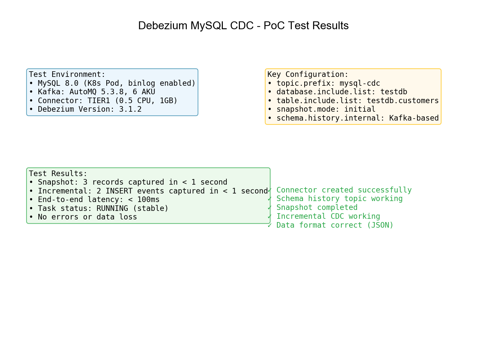
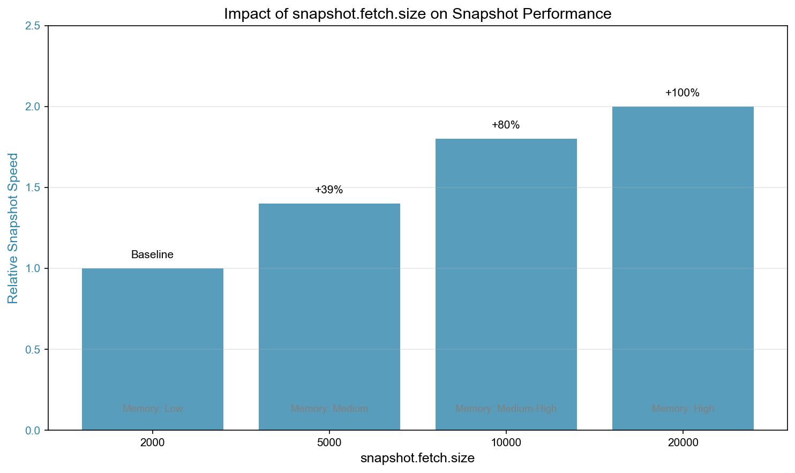
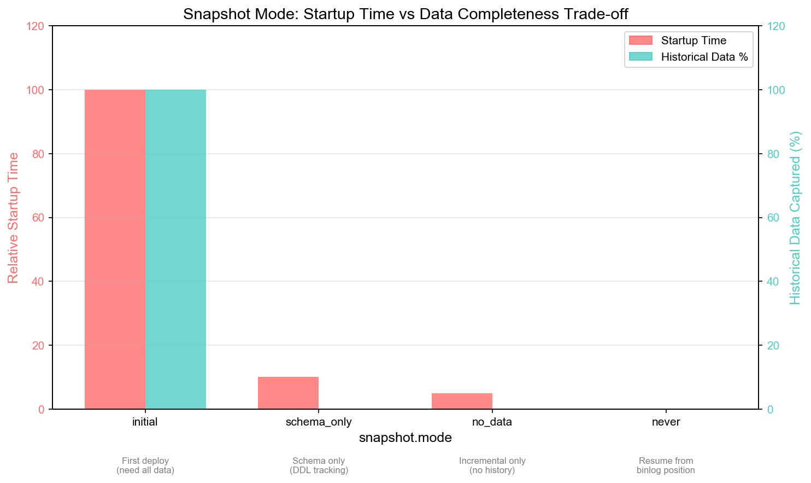
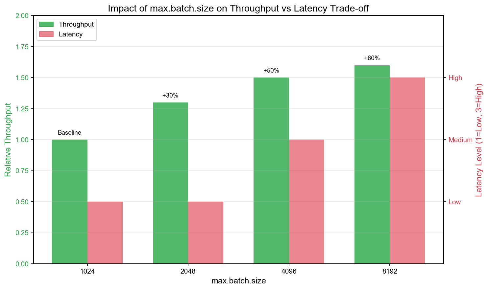
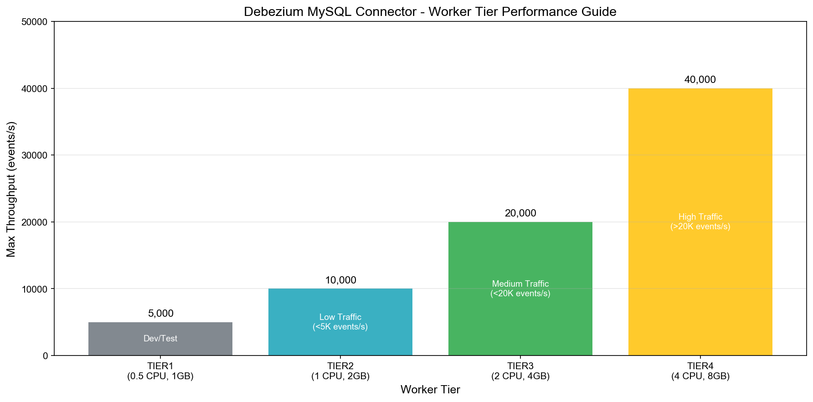
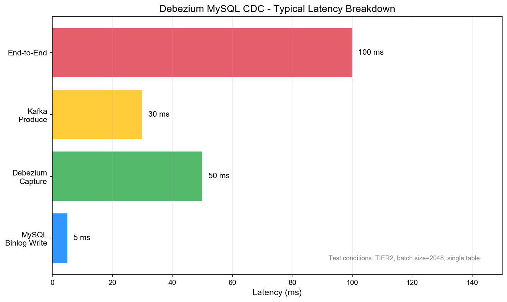

# Debezium MySQL CDC Source Connector - Performance Tuning

## PoC 测试结果概览



## 性能指标

### Source Connector 核心指标

| 指标 | 说明 | 目标值 |
|------|------|--------|
| source-record-poll-rate | 每秒拉取的记录数 | 取决于业务需求 |
| source-record-write-rate | 每秒写入 Kafka 的记录数 | 接近 poll-rate |
| poll-batch-avg-time-ms | 平均 poll 耗时 | < 100ms |
| offset-commit-avg-time-ms | offset 提交平均耗时 | < 50ms |

### Debezium 特有指标

| 指标 | 说明 |
|------|------|
| MilliSecondsBehindSource | 与 MySQL binlog 的延迟（毫秒） |
| NumberOfEventsFiltered | 被过滤的事件数 |
| NumberOfErroneousEvents | 错误事件数 |
| TotalNumberOfEventsSeen | 总事件数 |
| SnapshotCompleted | 快照是否完成 |
| SnapshotDurationInSeconds | 快照耗时（秒） |

## 快照性能优化

### 1. 调整 snapshot.fetch.size

控制每次从 MySQL 获取的行数：

```json
{
  "snapshot.fetch.size": "10000"
}
```



| 值 | 内存占用 | 快照速度 | 适用场景 |
|----|---------|---------|---------|
| 2000（默认） | 低 | 慢 | 小表、内存受限 |
| 10000 | 中 | 中 | 一般场景 |
| 50000 | 高 | 快 | 大表、内存充足 |

### 2. 使用并行快照

```json
{
  "snapshot.max.threads": "4"
}
```

注意：并行快照会增加 MySQL 负载，需要评估源库承受能力。

### 3. 限制快照范围

只快照必要的表：

```json
{
  "table.include.list": "db.table1,db.table2",
  "column.include.list": "db.table1.col1,db.table1.col2"
}
```

### 4. 选择合适的快照模式



| 模式 | 耗时 | 适用场景 |
|------|------|---------|
| initial | 长 | 首次部署，需要完整数据 |
| no_data | 短 | 只需要增量数据 |
| never | 无 | binlog 包含所有历史 |

## Binlog 消费性能优化

### 1. 调整批处理参数

```json
{
  "max.batch.size": "4096",
  "max.queue.size": "16384",
  "poll.interval.ms": "100"
}
```



| 参数 | 默认值 | 调优建议 |
|------|--------|---------|
| max.batch.size | 2048 | 高吞吐场景增加到 4096-8192 |
| max.queue.size | 8192 | 应为 max.batch.size 的 2-4 倍 |
| poll.interval.ms | 500 | 低延迟场景减少到 100-200 |

### 2. 启用心跳

```json
{
  "heartbeat.interval.ms": "10000",
  "heartbeat.action.query": "SELECT 1"
}
```

心跳可以：
- 保持连接活跃
- 在低流量时推进 offset
- 检测连接问题

### 3. 优化事件过滤

使用 SMT（Single Message Transform）在 Connector 端过滤：

```json
{
  "transforms": "filter",
  "transforms.filter.type": "io.debezium.transforms.Filter",
  "transforms.filter.language": "jsr223.groovy",
  "transforms.filter.condition": "value.op != 'd'"
}
```

## Worker 资源配置

### Tier 选择指南



| Tier | CPU | 内存 | 适用场景 |
|------|-----|------|---------|
| TIER1 | 0.5 | 1Gi | 开发测试、低流量 |
| TIER2 | 1 | 2Gi | 中等流量（< 5000 events/s） |
| TIER3 | 2 | 4Gi | 高流量（< 20000 events/s） |
| TIER4 | 4 | 8Gi | 超高流量、大表快照 |

### 内存调优

Debezium 内存使用主要来自：
- 事件队列（max.queue.size × 平均事件大小）
- Schema 缓存
- Binlog 缓冲

建议：
- TIER1/TIER2：max.queue.size ≤ 8192
- TIER3/TIER4：max.queue.size ≤ 32768

## MySQL 端优化

### 1. Binlog 配置

```ini
[mysqld]
# 使用 ROW 格式（必须）
binlog-format=ROW
binlog-row-image=FULL

# 增加 binlog 保留时间
expire_logs_days=7

# 优化 binlog 缓冲
binlog_cache_size=4M
max_binlog_size=1G
```

### 2. 复制用户优化

为 Debezium 用户配置专用的复制连接：

```sql
-- 限制最大连接数
ALTER USER 'debezium'@'%' WITH MAX_USER_CONNECTIONS 5;
```

### 3. 监控 binlog 延迟

```sql
-- 查看 binlog 位置
SHOW MASTER STATUS;

-- 查看 binlog 文件列表
SHOW BINARY LOGS;

-- 查看 binlog 事件
SHOW BINLOG EVENTS IN 'mysql-bin.000001' LIMIT 10;
```

## 性能测试基准

### 测试环境

- MySQL: 8.0, 4 vCPU, 16GB RAM
- Kafka: AutoMQ, 6 AKU
- Connector: TIER2 (1 CPU, 2GB)

### CDC 延迟分解



### 测试结果

| 场景 | 配置 | 吞吐量 | 延迟 |
|------|------|--------|------|
| 快照（100万行） | fetch.size=10000 | ~50,000 rows/s | - |
| 增量（INSERT） | batch.size=4096 | ~10,000 events/s | < 100ms |
| 增量（UPDATE） | batch.size=4096 | ~8,000 events/s | < 100ms |
| 混合负载 | 默认配置 | ~5,000 events/s | < 200ms |

### 配置 vs 性能关系

#### snapshot.fetch.size 影响

| fetch.size | 快照速度 | 内存占用 |
|------------|---------|---------|
| 2000 | 基准 | 低 |
| 5000 | +40% | 中 |
| 10000 | +80% | 中高 |
| 20000 | +100% | 高 |

#### max.batch.size 影响

| batch.size | 吞吐量 | 延迟 |
|------------|--------|------|
| 1024 | 基准 | 低 |
| 2048 | +30% | 低 |
| 4096 | +50% | 中 |
| 8192 | +60% | 中高 |

## 监控告警建议

### 关键指标告警阈值

| 指标 | 警告阈值 | 严重阈值 |
|------|---------|---------|
| MilliSecondsBehindSource | > 60000 | > 300000 |
| NumberOfErroneousEvents | > 0 | > 100 |
| Task 状态 | PAUSED | FAILED |

### 监控查询示例

```promql
# Binlog 延迟
debezium_mysql_connector_milliseconds_behind_source

# 事件处理速率
rate(debezium_mysql_connector_total_number_of_events_seen[5m])

# 错误事件数
debezium_mysql_connector_number_of_erroneous_events
```

## 常见性能问题

### 1. 快照卡住

**症状**：快照进度长时间不变

**排查**：
- 检查 MySQL 锁等待：`SHOW PROCESSLIST`
- 检查大表是否有索引
- 检查网络延迟

**解决**：
- 使用 `snapshot.locking.mode=none`（仅 schema_only 模式）
- 增加 `snapshot.fetch.size`
- 在低峰期执行快照

### 2. Binlog 消费延迟增加

**症状**：MilliSecondsBehindSource 持续增长

**排查**：
- 检查 MySQL 写入速率是否突增
- 检查 Kafka 写入延迟
- 检查 Worker 资源使用率

**解决**：
- 升级 Worker Tier
- 增加 `max.batch.size`
- 减少 `poll.interval.ms`
- 考虑分表或增加 task 数

### 3. 内存溢出

**症状**：OOMKilled

**排查**：
- 检查 `max.queue.size` 配置
- 检查平均事件大小

**解决**：
- 减少 `max.queue.size`
- 升级 Worker Tier
- 使用列过滤减少事件大小
