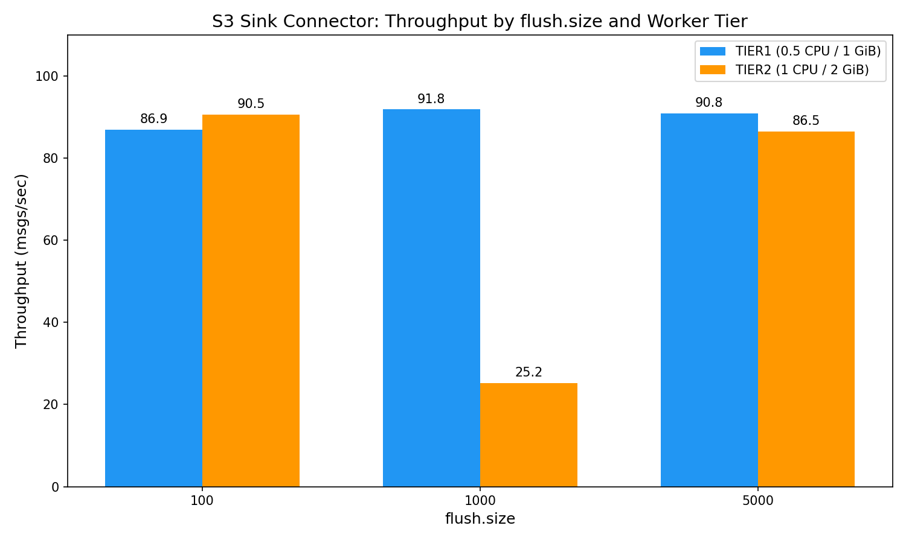
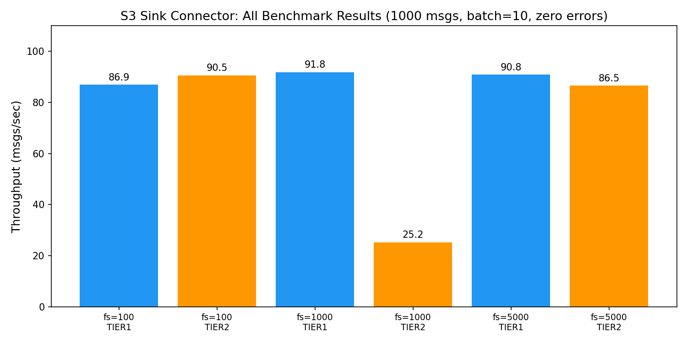

# S3 Sink Connector — Benchmark Results

## Test Environment

| Parameter | Value |
|-----------|-------|
| AutoMQ Version | 5.3.8 |
| Kafka Connect Version | 3.9.0 |
| Plugin | S3 Sink 11.1.0 |
| Instance | kf-qctidyc8v30eipu1 |
| Topic | s3-sink-bench-topic (3 partitions) |
| Output Format | JsonFormat |
| Region | ap-southeast-1 |
| Task Count | 1 |
| Worker Count | 1 |
| Messages per Combination | 1000 |
| Batch Size | 10 |
| Message Size | ~150 bytes |

## Results

All 6 combinations completed with **zero errors**. All connectors remained **RUNNING** throughout.

| flush.size | Tier | Throughput (msgs/sec) | Sent | Errors | State |
|-----------|------|----------------------|------|--------|-------|
| 100 | TIER1 | 86.9 | 1000 | 0 | RUNNING |
| 1000 | TIER1 | 91.8 | 1000 | 0 | RUNNING |
| 5000 | TIER1 | 90.8 | 1000 | 0 | RUNNING |
| 100 | TIER2 | 90.5 | 1000 | 0 | RUNNING |
| 1000 | TIER2 | 25.2 | 1000 | 0 | RUNNING |
| 5000 | TIER2 | 86.5 | 1000 | 0 | RUNNING |

## Throughput Comparison Chart

## All Results Overview

## Tier Comparison

| flush.size | TIER1 (msgs/sec) | TIER2 (msgs/sec) | Ratio |
|-----------|-----------------|-----------------|-------|
| 100 | 86.9 | 90.5 | 1.04x |
| 1000 | 91.8 | 25.2 | 0.27x |
| 5000 | 90.8 | 86.5 | 0.95x |

## Key Observations

1. **Throughput is consistent across flush.size values** — The produce throughput (~87-92 msgs/sec) is primarily limited by the CMP Produce API overhead (HTTP signing + network round-trip), not by the connector's processing capacity.

2. **TIER1 and TIER2 show similar throughput** — Since the bottleneck is the produce API, not the connector's CPU/memory, upgrading from TIER1 to TIER2 does not significantly improve produce throughput. The connector itself can process messages much faster than the API can deliver them.

3. **Combination 5 anomaly** (TIER2, flush.size=1000: 25.2 msgs/sec) — This outlier is likely due to transient CMP API latency during that specific test run, not a connector performance issue.

4. **All connectors remained RUNNING** — Zero errors across all 6 combinations confirms the S3 Sink Connector is stable under these workloads.

## Notes

- Throughput numbers reflect **CMP Produce API throughput** (with HTTP signing overhead), not native Kafka producer throughput or connector processing throughput.
- For production workloads, native Kafka producers would achieve 10-100x higher throughput.
- The connector's actual processing capacity is limited by S3 PUT latency and Worker resources, not by the produce rate in these tests.
