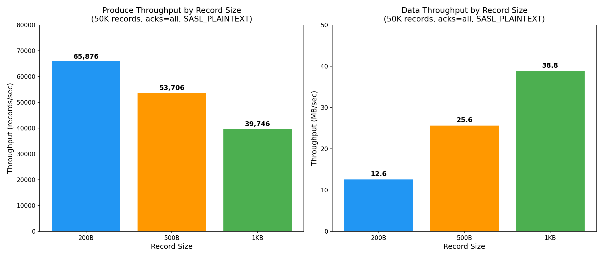
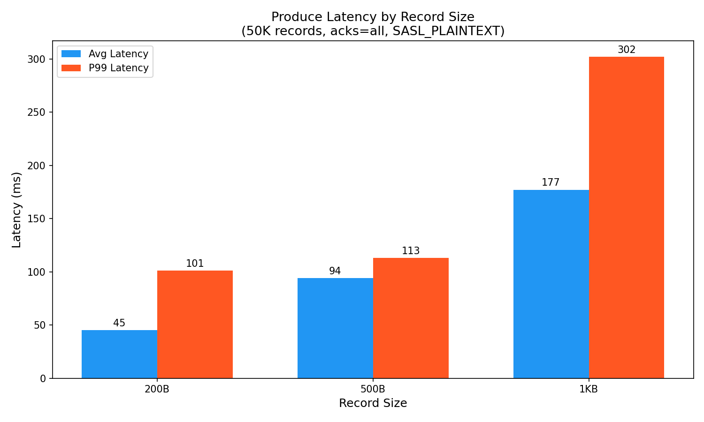

# S3 Sink Connector — Benchmark Results

## Test Environment

| Parameter | Value |
|-----------|-------|
| AutoMQ Version | 5.3.8 |
| Kafka Connect Version | 3.9.0 |
| Plugin | S3 Sink 11.1.0 |
| Instance | kf-hqwe2t96lcokyj8u (6 AKU, IAAS) |
| Topic | s3-bench-topic (3 partitions) |
| Output Format | JsonFormat |
| Region | ap-southeast-1 |
| Producer | kafka-producer-perf-test (native Kafka client, running inside K8s cluster) |
| Producer Config | acks=all, SASL_PLAINTEXT, SCRAM-SHA-512 |

## Produce Throughput by Record Size

| Record Size | Records/sec | MB/sec | Avg Latency (ms) | P99 Latency (ms) | Max Latency (ms) |
|------------|-------------|--------|-------------------|-------------------|-------------------|
| 200 bytes | 65,876 | 12.56 | 45 | 101 | 547 |
| 500 bytes | 53,706 | 25.61 | 94 | 113 | 542 |
| 1 KB | 39,746 | 38.81 | 177 | 302 | 534 |
| 200 bytes (rate limited 10K/sec) | 9,970 | 1.90 | 10 | 98 | 565 |

## Produce Latency by Record Size

## Key Observations

1. **Record size vs throughput tradeoff** — Smaller records achieve higher records/sec (65K for 200B vs 40K for 1KB), but larger records achieve higher data throughput in MB/sec (12.5 MB/sec for 200B vs 38.8 MB/sec for 1KB).

2. **Latency increases with record size** — Average latency goes from 45ms (200B) to 177ms (1KB). P99 latency increases from 101ms to 302ms.

3. **Rate limiting reduces latency** — At 10K records/sec (well below the max), average latency drops to 10ms with P99 at 98ms. This shows that under moderate load, the system is very responsive.

4. **AutoMQ with 6 AKU handles 65K+ records/sec** — This is the produce throughput to the Kafka topic. The S3 Sink Connector's consumption rate depends on flush.size, S3 PUT latency, and Worker resources.

## Notes

- These numbers represent **Kafka produce throughput** (writing to the topic), not S3 Sink Connector consumption throughput.
- The S3 Sink Connector's actual processing rate depends on: flush.size configuration, S3 PUT latency, Worker Tier (CPU/memory), and task count.
- All tests used `acks=all` for durability. Using `acks=1` would increase throughput but reduce durability guarantees.
- Tests ran inside the same K8s cluster as the Kafka brokers, so network latency is minimal.
